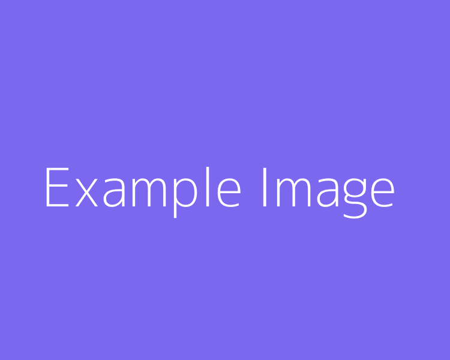

# Markdown reference

[TOC]

-------------------------------------------------------------------------------

## Titles

What does each thing look like with my stylesheet.

This is just a modified version of this [site](https://github.com/adam-p/markdown-here/wiki/Markdown-Cheatsheet)

```no-highlight
# H1 - Almost before we knew it, we had left the ground
## H2 - Almost before we knew it, we had left the ground
### H3 - Almost before we knew it, we had left the ground
#### H4 - Almost before we knew it, we had left the ground
##### H5 - Almost before we knew it, we had left the ground
###### H6 - Almost before we knew it, we had left the ground
```

# H1 - Almost before we knew it, we had left the ground
## H2 - Almost before we knew it, we had left the ground
### H3 - Almost before we knew it, we had left the ground
#### H4 - Almost before we knew it, we had left the ground
##### H5 - Almost before we knew it, we had left the ground
###### H6 - Almost before we knew it, we had left the ground


-------------------------------------------------------------------------------

## Font Styling

```no-highlight
Emphasis, aka italics, with *asterisks* or _underscores_.

Strong emphasis, aka bold, with **asterisks** or __underscores__.

Combined emphasis with **asterisks and _underscores_**.

Strikethrough uses two tildes. ~~Scratch this.~~

Addition uses two plus signs ++add this.++
```

Emphasis, aka italics, with *asterisks* or _underscores_.

Strong emphasis, aka bold, with **asterisks** or __underscores__.

Combined emphasis with **asterisks and _underscores_**.

Strikethrough uses two tildes. ~~Scratch this.~~

Addition uses two plus signs ++add this.++


-------------------------------------------------------------------------------

## Lists

(In this example, leading and trailing spaces are shown with with dots: ⋅)

```no-highlight
1. First ordered list item
2. Another item
⋅⋅* Unordered sub-list. 
1. Actual numbers don't matter, just that it's a number
⋅⋅1. Ordered sub-list
4. And another item.

⋅⋅⋅You can have properly indented paragraphs within list items. Notice the blank line above, and the leading spaces (at least one, but we'll use three here to also align the raw Markdown).

⋅⋅⋅To have a line break without a paragraph, you will need to use two trailing spaces.⋅⋅
⋅⋅⋅Note that this line is separate, but within the same paragraph.⋅⋅
⋅⋅⋅(This is contrary to the typical GFM line break behaviour, where trailing spaces are not required.)

* Unordered list can use asterisks
- Or minuses
+ Or pluses
```

1. First ordered list item
2. Another item
  * Unordered sub-list. 
1. Actual numbers don't matter, just that it's a number
  1. Ordered sub-list
4. And another item.

   You can have properly indented paragraphs within list items. Notice the blank line above, and the leading spaces (at least one, but we'll use three here to also align the raw Markdown).

   To have a line break without a paragraph, you will need to use two trailing spaces.  
   Note that this line is separate, but within the same paragraph.  
   (This is contrary to the typical GFM line break behaviour, where trailing spaces are not required.)

* Unordered list can use asterisks
- Or minuses
+ Or pluses


-------------------------------------------------------------------------------

## Links

There are two ways to create links.

```no-highlight
[I'm an inline-style link](https://www.google.com)

[I'm an inline-style link with title](https://www.google.com "Google's Homepage")

[I'm a reference-style link][reference text]

[I'm a relative reference to a repository file](../blob/master/LICENSE)

[You can use numbers for reference-style link definitions][1]

Or leave it empty and use the [link text itself]

Some text to show that the reference links can follow later.

[reference text]: https://www.mozilla.org "references can have titles also"
[1]: http://slashdot.org
[link text itself]: http://www.reddit.com
```

[I'm an inline-style link](https://www.google.com)

[I'm an inline-style link with title](https://www.google.com "Google's Homepage")

[I'm a reference-style link][Arbitrary case-insensitive reference text]

[I'm a relative reference to a repository file](../blob/master/LICENSE)

[You can use numbers for reference-style link definitions][1]

Or leave it empty and use the [link text itself]

Some text to show that the reference links can follow later.

[arbitrary case-insensitive reference text]: https://www.mozilla.org
[1]: http://slashdot.org
[link text itself]: http://www.reddit.com


-------------------------------------------------------------------------------

## Images

The example images was [generated](https://dummyimage.com/750x600/7c68ee/fff.png&text=Example+Image) using [this dummy image generator](https://dummyimage.com/).


```no-highlight
Inline-style: 



Reference-style: 

![alt text][image]

[image]: static.png "Title Text 2"

If no title then alt text becomes the title:


You can also just put the image url on its own line:

static.png
```

Inline-style: 


Reference-style: 

![alt text][image]

[image]: static.png "Title Text 2"

If no title then alt text becomes the title:


You can also just put the image url on its own line:

static.png


-------------------------------------------------------------------------------

## Code and Syntax Highlighting

Code Highlighting uses Highlight.js format. To see what languages are available for highlighting, and how to write those language names, see the [highlight.js demo page](http://softwaremaniacs.org/media/soft/highlight/test.html).

```no-highlight
Inline `code` has `back-ticks around` it.
```

Inline `code` has `back-ticks around` it.

Blocks of code are either fenced by lines with three back-ticks <code>```</code>, or are indented with four spaces. Only fenced code blocks support syntax highlighting.

```no-highlight
 ```javascript
 var s = "JavaScript syntax highlighting";
 alert(s);
 ```
 
 ```python
 s = "Python syntax highlighting"
 print s
 ```
 
 ```
 No language indicated, so no syntax highlighting. 
 But let's throw in a <b>tag</b>.
 ```
```

```javascript
var s = "JavaScript syntax highlighting";
alert(s);
```

```python
s = "Python syntax highlighting"
print s
```

```
No language indicated, so no syntax highlighting in Markdown Here (varies on Github). 
But let's throw in a <b>tag</b>.
```


-------------------------------------------------------------------------------

## Tables

```no-highlight
Colons can be used to align columns.

| Tables        | Are           | Cool  |
| ------------- |:-------------:| -----:|
| col 3 is      | right-aligned | $1600 |
| col 2 is      | centered      |   $12 |
| zebra stripes | are neat      |    $1 |

The outer pipes (|) are optional, and you don't need to make the raw Markdown line up prettily. You can also use inline Markdown.

Markdown | Less | Pretty
--- | --- | ---
*Still* | `renders` | **nicely**
1 | 2 | 3
```

Colons can be used to align columns.

| Tables        | Are           | Cool |
| ------------- |:-------------:| -----:|
| col 3 is      | right-aligned | $1600 |
| col 2 is      | centered      |   $12 |
| zebra stripes | are neat      |    $1 |

The outer pipes (|) are optional, and you don't need to make the raw Markdown line up prettily. You can also use inline Markdown.

Markdown | Less | Pretty
--- | --- | ---
*Still* | `renders` | **nicely**
1 | 2 | 3


-------------------------------------------------------------------------------

## Blockquotes

```no-highlight
> Blockquotes are very handy in email to emulate reply text.
> This line is part of the same quote.

Quote break.

> This is a very long line that will still be quoted properly when it wraps. Oh boy let's keep writing to make sure this is long enough to actually wrap for everyone. Oh, you can *put* **Markdown** into a blockquote. 
```

> Blockquotes are very handy in email to emulate reply text.
> This line is part of the same quote.

Quote break.

> This is a very long line that will still be quoted properly when it wraps. Oh boy let's keep writing to make sure this is long enough to actually wrap for everyone. Oh, you can *put* **Markdown** into a blockquote. 


-------------------------------------------------------------------------------

## Inline HTML

You can also use raw HTML in your Markdown, and it'll mostly work pretty well. 

```no-highlight
<dl>
  <dt>Definition list</dt>
  <dd>Is something people use sometimes.</dd>

  <dt>Markdown in HTML</dt>
  <dd>Does *not* work **very** well. Use HTML <em>tags</em>.</dd>
</dl>
```

<dl>
  <dt>Definition list</dt>
  <dd>Is something people use sometimes.</dd>

  <dt>Markdown in HTML</dt>
  <dd>Does *not* work **very** well. Use HTML <em>tags</em>.</dd>
</dl>


-------------------------------------------------------------------------------

## Horizontal Rule

```
Three or more...

---

Hyphens

***

Asterisks

___

Underscores
```

Three or more...

---

Hyphens

---

Asterisks

---

Underscores


-------------------------------------------------------------------------------

## Line Breaks

Line breaks are interpreted literally.

```
Here's a line for us to start with.

This line is separated from the one above by two newlines, so it will be a *separate paragraph*.

This line is also a separate paragraph, but...
This line is only separated by a single newline, so it's a separate line in the *same paragraph*.
```

Here's a line for us to start with.

This line is separated from the one above by two newlines, so it will be a *separate paragraph*.

This line is also begins a separate paragraph, but...  
This line is only separated by a single newline, so it's a separate line in the *same paragraph*.


-------------------------------------------------------------------------------

## Admonition

[Syntax Documentation](https://pythonhosted.org/Markdown/extensions/admonition.html). The admonition classes are:

* error
* notice
* info
* success

which are based off of the [Blueprint CSS notice classes](http://www.blueprintcss.org/tests/parts/forms.html):

```no-highlight
!!! error
    this is an error admonition

!!! notice
    this is an notice admonition

!!! info
    this is an info admonition

!!! success
    this is an success admonition
```

<div class="admonition error">
<p class="admonition-title">Error</p>
<p>this is an error admonition</p>
</div>
<div class="admonition notice">
<p class="admonition-title">Notice</p>
<p>this is an notice admonition</p>
</div>
<div class="admonition info">
<p class="admonition-title">Info</p>
<p>this is an info admonition</p>
</div>
<div class="admonition success">
<p class="admonition-title">Success</p>
<p>this is an success admonition</p>
</div>


-------------------------------------------------------------------------------

## Youtube videos

```no-highlight
<a href="http://www.youtube.com/watch?feature=player_embedded&v=YOUTUBE_VIDEO_ID_HERE
" target="_blank"></a>
```

Or, in pure Markdown, but losing the image sizing and border:

```no-highlight
[](http://www.youtube.com/watch?v=YOUTUBE_VIDEO_ID_HERE)
```

or using the embed plugin:

```no-highlight
before text

https://www.youtube.com/watch?v=dQw4w9WgXcQ

after text
```

before text

https://www.youtube.com/watch?v=dQw4w9WgXcQ

after text

-------------------------------------------------------------------------------

## Twitter

You can embed twitter tweets by putting them on their own line:

```no-highlight
before text

https://twitter.com/JohnKirk/status/801086441325375491

after text
```

before text

https://twitter.com/JohnKirk/status/801086441325375491

after text


-------------------------------------------------------------------------------

## Vimeo

```no-highlight
before text

https://vimeo.com/182739998

after text
```

before text

https://vimeo.com/182739998

after text


-------------------------------------------------------------------------------

## Footnotes

[python markdown footnote documentation](http://pythonhosted.org/Markdown/extensions/footnotes.html)

```no-highlight
This text has a footnote[^1]

[^1]: this is the footnote
```

if you always use `[^n]` then your footnotes will be added in the order they appear, that way you don't have to worry about always coming up with unique names.

This text has a footnote[^1]

[^1]: this is the footnote

-------------------------------------------------------------------------------

## Table of Contents

If you place `[TOC]` in your file somewhere, then a table of contents will be added at that location using the headers.

